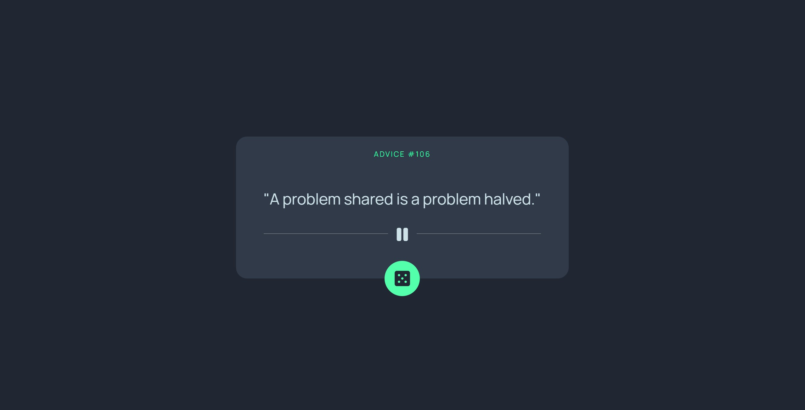

# Frontend Mentor - Advice generator app solution

This is a solution to the [Advice generator app challenge on Frontend Mentor](https://www.frontendmentor.io/challenges/advice-generator-app-QdUG-13db).

## Table of contents

-   [Overview](#overview)
    -   [The challenge](#the-challenge)
    -   [Screenshot](#screenshot)
    -   [Links](#links)
-   [My process](#my-process)
    -   [Built with](#built-with)
    -   [What I learned](#what-i-learned)
-   [Author](#author)

## Overview

### The challenge

Users should be able to:

-   View the optimal layout for the app depending on their device's screen size
-   See hover states for all interactive elements on the page
-   Generate a new piece of advice by clicking the dice icon

### Screenshot

### Links

-   Solution URL: [https://legendary-nougat-28dee2.netlify.app/](https://legendary-nougat-28dee2.netlify.app/)

## My process

### Built with

-   Vite
-   Mobile-first workflow
-   fetch API
-   adviceslip API
-   [React](https://reactjs.org/) - JS library

### What I learned

This was my first attempt at using Vite and React in a project, as well as parsing data from an external API using fetch. This project helped to serve as a confidence booster as I was able to make something actually work using React.

## Author

-   Website - [https://www.coolesthandluke.com](https://www.coolesthandluke.com)
-   Frontend Mentor - [https://www.frontendmentor.io/profile/coolesthandluke](https://www.frontendmentor.io/profile/coolesthandluke)
